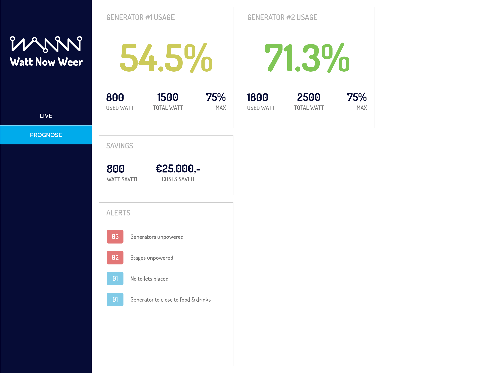
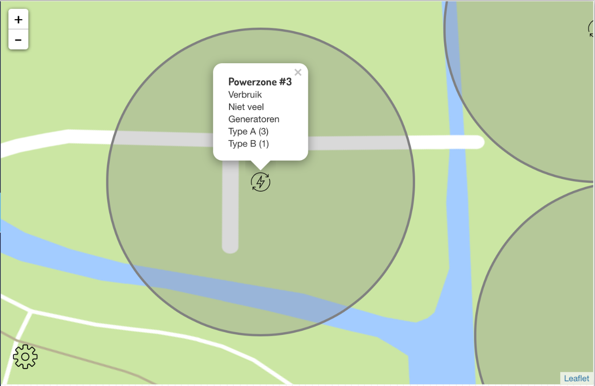
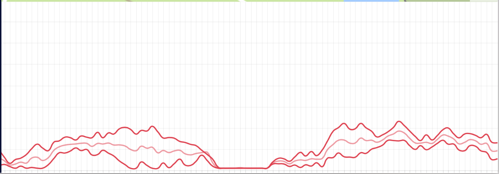

# Watt Now Weer

Watt Now Weer is a full-fledged planning and monitoring tool for power-management of (large-scale) festivals. The application provides organizers with a means to plan the ideal festival layouts with ease. Create a map that suits the needs of your festival, get rich information on the expected power usage and usage peaks and monitor the usage in real-time while the festival is in full effect. Watt Now Weer makes planning and maintaining power setups of festivals a breeze!

## Features
* [x] Map overview including scale, zoom and drag'n drop functionalities
* [x] Planning tool to place and configure objects (e.g. radius, electricity usage, costs)
* [x] Console containing rich information about the current setup
* [x] Generate expectation reports based on the created planning
* [x] Real-time usage charts during the festival
* [x] Websockets allowing you to collaborate real-time

## Use case
An organisator of a festival wants to lower the costs of the electricity, and he wants to be sure all generators are used in the most effective way. For this festival he and his team will be using the _Watt Now Weer_ dashboard to plan and monitor the eletricity planning. They create a map determing the longtitude/latitude and zoom in on the location of the festival. Then they determine the scale of the map, followed by placing a few objects. They immediately get feedback from the console that certain objects are unpowered, because there is no generator in range. They place a generator. Soon after they get feedback from the console to reallocate objects to make sure the generator is used for 75% of its usage (this is the most effective number for a generator to be fully productive). Shortly after finishing the map they generate a report on the "Prognose" tab. This allows them to see what is good and what needs to be improved, e.g. the usage of generators, or maybe some important objects for the festival are missing, like toilets.

During the building of the festival and during the actual festival they can use their iPads to use the dashboard, and check out real-time statistics. This allows them to analyse and future improve their festivals to have the most efficient and cost-effective setup.

## Wish list
- [ ] Create and manage multiple festival setups
- [ ] Create and manage teams to collaborate on different festival projects
- [ ] Real-time chat allowing users to communicate in the dashboard
- [ ] Manage charts layouts to your own wishes

## Design proposal
_Planning #1 — User drags objects to map_


_Planning #2 — Overview of all objects with notifications_


_Live #1 — Some objects aren't connected to a power source_


_Live #2 — Overview of power usage_


_Expectation — Expected values over time_


## Installation
```bash
$ git clone https://github.com/larsdouweschuitema/watt-now-weer.git
```

The interactive demo is a static website. You'll need a simple webserver like [`http-server`](npmjs.org/packages/http-server) to serve the files.

## Prototype tests
### Leaflet
> [Leaflet](http://leafletjs.com/) is designed with simplicity, performance and usability in mind. It works efficiently across all major desktop and mobile platforms, can be extended with lots of plugins, has a beautiful, easy to use and well-documented API and a simple, readable source code that is a joy to contribute to.



Leaflet has proven itself to be the ideal map library to work with in this concept. It's very open and flexible api provides us with easy ways to import custom maps and grid coordinates (ideal for uploading festival maps). Leaflets marker api provides us with the means to create custom marker objects and update these on the fly.

http://leafletjs.com/

### GraphJS
While GraphJS's initial setup is very easy, it's extensibility and api leave some things to be desired. However, we were able to create a very simple (axis-less) graph for demo purposes for now for which the data was provided by [our custom made fake-power-data-generator plugin](https://github.com/rijkvanzanten/random-power-data)

We wouldn't use GraphJS to implement such a feature in real-life but probably move to a more feature-rich option like [D3.js](https://d3js.org/)



http://www.chartjs.org/

### Chart Data
The data which is displayed in the charts will be provided by actual measurement units implemented and provided by Watt Now. For this demo, we've created a small random-data generator api which provides us with somewhat realistically acting power usage statistics. The api works over websockets and can be accessed via `ws://power.rijks.website`. The code used to generate this data has been open sourced and can be accessed through the [`random-power-data`](https://github.com/rijkvanzanten/random-power-data) repository.


## Team
 | 
---|---
[Rijk van Zanten](https://github.com/rijkvanzanten) | [Lars Schuitema](https://github.com/larsdouweschuitema)
## Licenses
MIT © Lars Douwe Schuitema
