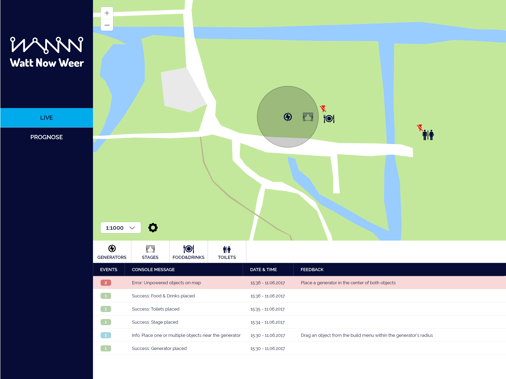
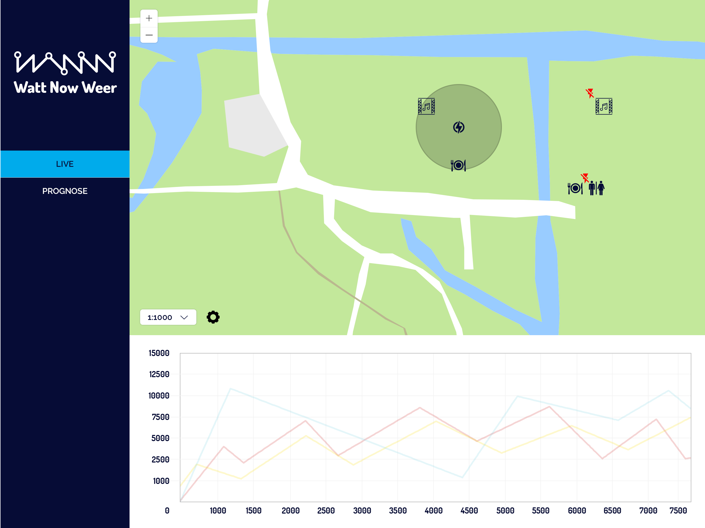
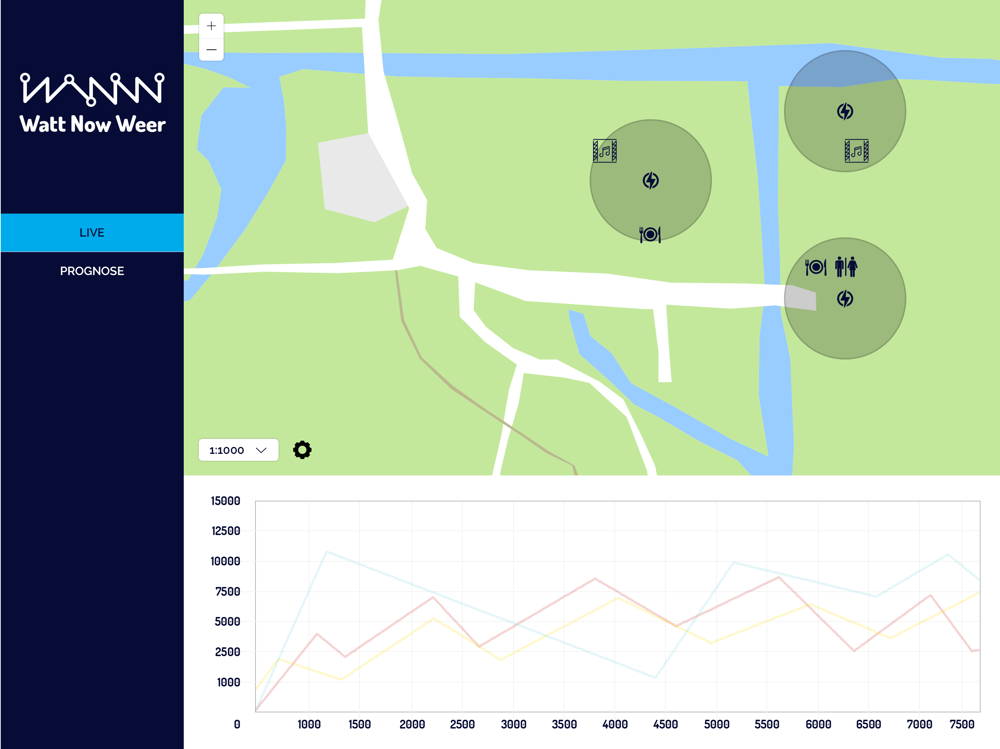
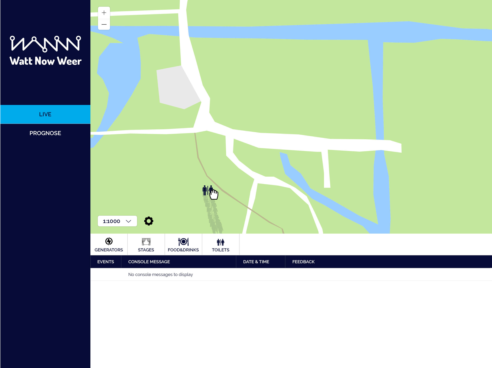

A real-time dashboard for organisators of festivals allowing them to create the most cost-effective planning for their festival. Users can collaborate before and during the festival. Create a map that suits the needs of your festival. Then collaborate during the festival by watching real-time statistics, allowing the user to optimize the map during the festival.

## Features
* [x] Map overview including scale, zoom and drag'n drop functionalities
* [x] Build tool to place and configure objects (e.g. radius, electricity usage, costs)
* [x] Console containing error, info and success messages
* [x] Generate expectation report based on the created map
* [x] Real-time charts before and during the festival
* [x] Web Sockets allowing you to collaborate real-time

## Use case
An organisator of a festival wants to lower the costs of the electricity, and he wants to be sure all generators are used in the most effective way. For this festival he and his team will be using the "Watt Now Weer" dashboard to plan and monitor the eletricity planning. They create a map determing the longtitude/latitude and zoom in on the location of the festival. Then they determine the scale of the map, followed by placing a few objects. They immediately get feedback from the console that certain objects are unpowered, because there is no generator in range. They place a generator. Soon after they get feedback from the console to reallocate objects to make sure the generator is used for 75% of its usage (this is the most effective number for a generator to be fully productive). Shortly after finishing the map they generate a report on the "Prognose" tab. This allows them to see what is good and what needs to be improved, e.g. the usage of generators, or maybe some important objects for the festival are missing, like toilets.

During the building of the festival and during the actual festival they can use their iPads to use the dashboard, and check out real-time statistics. This allows them to analyse and future improve their festivals to have the most efficient and cost-effective setup.

## Wish list
* Create and manage multiple festival setups
* Create and manage teams to collaborate on different festival projects
* Real-time chat allowing users to communicate in the dashboard
* Manage charts layouts to your own wishes

## Screenshots








## Installation
```bash
$ git clone https://github.com/larsdouweschuitema/watt-now-weer.git
```

## Team
 | 
---|---
[Rijk van Zanten](https://github.com/rijkvanzanten) | [Lars Schuitema](https://github.com/larsdouweschuitema)

## Licenses
MIT © Lars Douwe Schuitema
